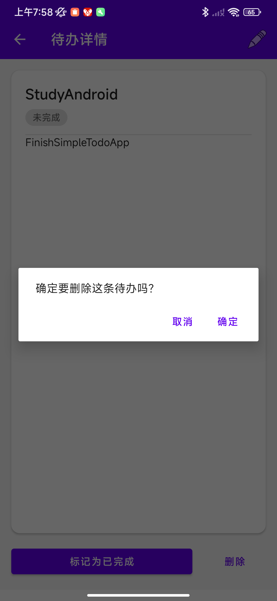
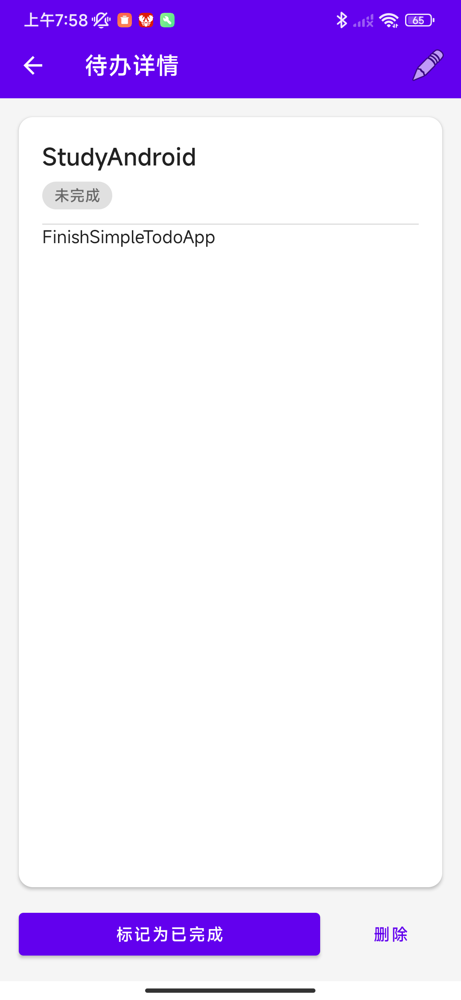
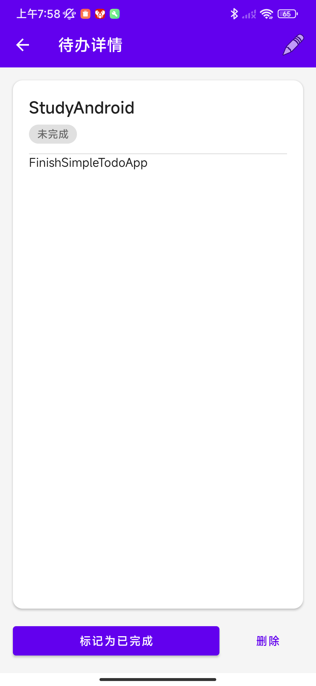
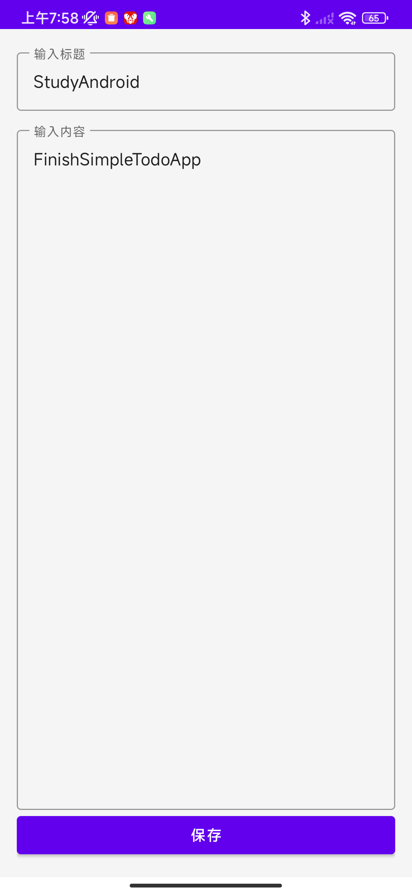
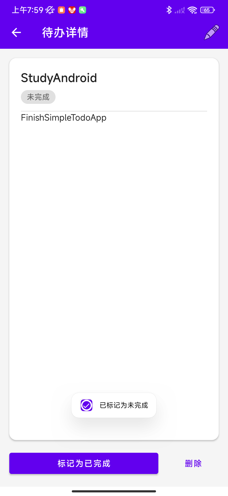
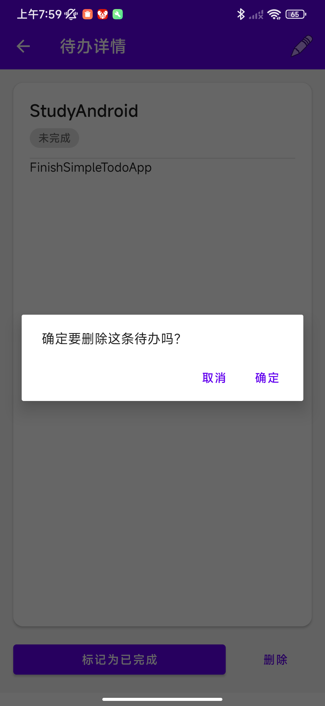

# SimpleTodoApp 📝

基于 Android 的简易待办应用 —— 移动应用开发（Android）课程期末大作业

## 功能

- **创建待办** — 输入标题和内容，快速记录待办事项
- **查看待办** — 列表展示所有待办，支持点击查看详情
- **编辑待办** — 详情页工具栏编辑按钮，修改已有内容
- **删除待办** — 确认弹窗后删除
- **状态切换** — 标记已完成/未完成

## 技术栈

| 层级 | 技术 |
|------|------|
| 编程语言 | Java |
| 数据库 | SQLite（本地存储） |
| UI 框架 | Material Components + ConstraintLayout |
| 列表展示 | RecyclerView + CardView |
| 构建工具 | Gradle 8.9 + AGP 8.7.3 |
| 最低 SDK | API 26 (Android 8.0) |

## 项目结构

```
app/src/main/java/com/andy/simpletodo/
├── MainActivity.java              # 主界面（待办列表）
├── AddEditTodoActivity.java       # 新增/编辑待办
├── TodoDetailActivity.java        # 待办详情
├── data/
│   ├── Todo.java                  # 数据模型
│   └── TodoDatabaseHelper.java    # SQLite 数据库操作
└── adapter/
    └── TodoAdapter.java           # RecyclerView 适配器
```

## 数据库设计

表名：`todos`

| 字段 | 类型 | 说明 |
|------|------|------|
| id | INTEGER | 主键，自增 |
| title | TEXT | 待办标题 |
| content | TEXT | 待办内容 |
| created_at | INTEGER | 创建时间戳 |
| updated_at | INTEGER | 更新时间戳 |
| is_completed | INTEGER | 完成状态（0/1） |

## 界面截图

| 空状态 | 添加待办 |
|--------|----------|
|  |  |
| **待办列表** | **详情页** |
|  |  |
| **编辑页面** | **已完成状态** |
|  |  |
| **删除确认** |
|  |

## 构建与运行

```bash
# 构建 Debug APK
./gradlew assembleDebug

# APK 位置
app/build/outputs/apk/debug/app-debug.apk
```

## 提交信息

- **学号：** 202325040118
- **姓名：** 连佳炜
- **班级：** 计算机科学与技术
- **仓库：** https://github.com/bLuesCreater/SimpleTodoApp
